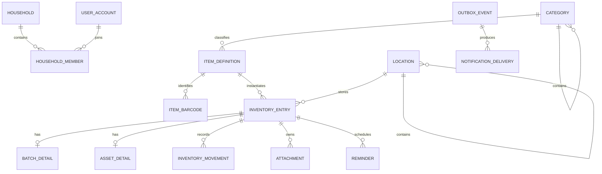
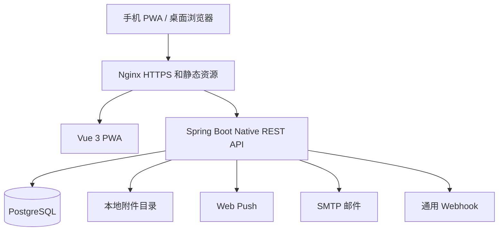

# Family Assets 家庭资产管理系统设计规格

- 日期：2026-07-10
- 状态：已批准，可进入实施计划与执行
- 部署模型：单个家庭、多位成员、自托管
- 架构方案：模块化单体

## 1. 产品目标

Family Assets 用于管理家庭中的日常消耗品和耐用电子设备。第一版首先解决四个问题：

1. 家里有哪些物品；
2. 物品目前放在哪里；
3. 每种物品还剩多少；
4. 哪些物品即将或已经过期。

系统采用手机优先的响应式 Web/PWA。手机负责扫码、快速入库、领用、查询和处理提醒；桌面浏览器负责批量整理、成员权限、分类模板、位置和通知配置。

### 1.1 成功标准

- 已有物品档案时，普通成员可在 30 秒内完成一次入库。
- 搜索结果同时展示总量、位置、最近批次和最早过期日期。
- 重复请求不会重复增加或扣减库存。
- 多成员并发领用不会产生负库存。
- 外部通知发送失败不会导致库存事务失败。
- JVM 和 GraalVM 原生程序通过同一组核心业务测试。
- PostgreSQL、附件和配置能够备份并恢复。

## 2. 第一版范围

### 2.1 包含功能

- 单个家庭空间和多成员账号；
- 管理员、普通成员、只读成员三种角色；
- 管理员创建账号或发送一次性邀请；
- 成员修改密码、管理员临时重置密码和初始管理员维护恢复；
- 树形分类和树形位置；
- 固定核心字段、分类属性模板和管理员自定义字段；
- 物品档案、批次库存和独立资产；
- 入库、领用、消耗、转移、盘点调整、丢失和报废流水；
- 条码识别、位置二维码和快捷入库；
- 图片、发票和保修凭证附件；
- 临期、过期和低库存提醒；
- 应用内、Web Push、邮件和通用 Webhook 通知；
- 全局搜索、按分类和位置筛选、CSV 导出；
- 操作审计、通知失败查看与重试；
- PWA 应用外壳缓存和离线草稿恢复；
- Docker Compose 部署、健康检查、备份和恢复。

### 2.2 明确不包含

- 公开注册、多家庭租户和 SaaS 计费；
- AI 图片识别、OCR 和自动生成物品信息；
- 采购订单、供应商和完整采购流程；
- 设备维修工单、资产折旧和财务核算；
- 完整离线库存写入和冲突合并；
- 原生 Android 或 iOS 客户端；
- 微服务、消息队列和分布式事务；
- S3 等远程对象存储。第一版只提供本地持久化附件目录。

## 3. 用户和权限

### 3.1 账号加入方式

首次启动通过一次性初始化流程创建家庭和首位管理员。此后关闭公开注册，只允许管理员直接创建成员或生成一次性邀请链接。邀请有明确失效时间，使用后立即作废。

已登录成员可以修改自己的密码。管理员可以为其他成员生成一次性临时密码，并要求成员下次登录时修改。唯一管理员遗忘密码时，通过原生程序提供的本机维护命令重置；该命令只能在服务器终端执行，并记录安全审计，不提供匿名 Web 找回入口。

### 3.2 角色

| 角色 | 权限 |
| --- | --- |
| 管理员 | 成员和权限、分类模板、位置、通知渠道、备份设置以及全部库存操作 |
| 普通成员 | 查询、创建和编辑物品档案、入库、领用、转移、调整和处理提醒 |
| 只读成员 | 查询、查看提醒、查看流水和导出，不允许修改业务数据 |

后端对每个写接口执行权限校验；前端隐藏按钮只用于改善体验，不作为安全边界。

## 4. 核心概念和日期语义

### 4.1 物品档案

物品档案描述“这是什么”，不直接表示当前库存。核心字段包括名称、分类、品牌、型号、规格、默认单位、条码、标签、默认保质期和封面图片。

### 4.2 库存单元

库存单元描述“实际持有什么”。类型为：

- `BATCH`：食品、药品和日用品等可合并计量的批次库存；
- `ASSET`：手机、电脑和家电等需要逐件追踪的独立资产。

批次库存允许数量大于 1。独立资产数量恒为 1，并拥有资产编号、序列号、购买日期、保修到期日期和状态。

第一版独立资产状态固定为 `AVAILABLE`、`IN_USE`、`LOANED`、`LOST` 和 `RETIRED`。状态变化写入库存流水或审计历史；第一版不为维修状态提供工单流程。

每个库存单元在任一时刻只属于一个位置。批次的一部分被转移到其他位置时，系统拆分出新的库存单元并继承原批次信息，同时保留来源关联。

### 4.3 日期字段

| 字段 | 语义 | 数据类型 |
| --- | --- | --- |
| 入库时间 | 实际进入家庭库存的时间 | 带时区时间戳 |
| 生产日期 | 商品生产日期 | 日期 |
| 保质期 | 从生产日期开始计算的时长 | 数值和 DAY/MONTH/YEAR 单位 |
| 过期日期 | 提醒和排序使用的最终日期 | 日期 |
| 有效期 | 证件、许可证、滤芯等分类属性的起止日期 | 分类属性中的日期 |
| 购买时间 | 独立资产的购买时间 | 日期 |
| 保修到期 | 独立资产的保修结束日期 | 日期 |

用户直接输入的过期日期优先；否则由生产日期和保质期计算。月和年使用日历运算，不按固定天数换算。

## 5. 关键业务流程

### 5.1 快捷入库

1. 成员扫描商品条码、位置二维码，或按名称搜索；商品条码只匹配本系统已经保存的物品档案，不调用外部商品数据库；
2. 匹配已有物品档案；未命中时快速新建档案；
3. 根据分类默认值选择批次或独立资产，成员可以修改；
4. 填写数量、位置、生产日期、过期日期、批次号或序列号；
5. 预览库存变化和计算出的提醒日期；
6. 提交后在一个事务中创建库存单元、追加入库流水、更新库存快照并写入 Outbox 事件；
7. 后台任务根据事件创建提醒计划。

### 5.2 领用和消耗

成员从物品、批次或位置页面发起领用。系统默认优先推荐最早过期且可用的批次，但最终由成员确认。提交时锁定库存单元、校验可用数量并写入负向流水。数量不足返回冲突错误，不允许自动扣成负数。

### 5.3 转移

完整转移直接修改库存单元位置并追加转移流水。批次部分转移会拆分目标库存单元；独立资产只能整件转移。

### 5.4 调整和报废

盘点差异通过调整流水纠正，不直接覆盖历史。丢失、过期处理和报废使用带原因的专用流水。错误流水不能修改或删除，只能通过反向调整纠正。

## 6. 信息架构和交互

### 6.1 移动端导航

底部导航固定为：

1. 首页；
2. 物品；
3. 中央快捷入库；
4. 提醒；
5. 我的。

首页采用任务和提醒优先布局，依次展示全局搜索、快捷入库、30 天内到期数量、已过期数量、低库存数量和需要处理的具体项目。位置树和分类浏览位于物品页。

### 6.2 入库向导

入库分为扫描或搜索、匹配物品、填写本次入库、确认提交四步。每一步自动保存草稿。返回上一步不丢失内容，最终提交前展示具体库存变化。

### 6.3 离线边界

Service Worker 缓存应用外壳和最近使用的只读数据。入库表单、照片和扫码结果保存在浏览器 IndexedDB 草稿中，默认保留 7 天。退出登录时清除当前账号草稿。

库存写操作必须联网完成。恢复联网后，服务端重新校验物品、位置、版本和库存；不实现离线写队列和自动冲突合并。

### 6.4 搜索行为

全局搜索覆盖物品名称、品牌、型号、规格、条码、资产编号、序列号、标签和位置名称。条码、资产编号和序列号优先精确匹配；其他文本进行大小写和常见空白归一化后的包含与模糊匹配。中文名称使用 PostgreSQL `pg_trgm` 的相似度和包含查询，不依赖英文分词规则。

## 7. 数据模型

### 7.1 主要实体

| 实体 | 主要职责 |
| --- | --- |
| `household` | 单个家庭的名称、时区和默认设置 |
| `user_account` | 登录账号和账号状态 |
| `household_member` | 用户在家庭中的角色 |
| `member_invite` | 一次性邀请及失效状态 |
| `user_session` | 服务端持久化会话和撤销状态 |
| `location` | 自引用父节点的树形位置 |
| `category` | 树形分类、默认库存类型和属性模板 |
| `item_definition` | 物品档案和自定义属性值 |
| `item_barcode` | 一个档案对应的一个或多个唯一条码 |
| `inventory_entry` | 当前持有的批次或独立资产库存单元 |
| `batch_detail` | 批次号和批次专有信息 |
| `asset_detail` | 资产号、序列号、购买和保修信息 |
| `inventory_movement` | 只追加的库存历史事实 |
| `attachment` | 图片和文档元数据及存储路径 |
| `reminder` | 临期、过期和低库存提醒实例 |
| `notification_channel` | 用户或家庭启用的通知渠道 |
| `notification_delivery` | 每个渠道的发送状态和重试信息 |
| `outbox_event` | 与业务事务一起提交的待处理事件 |
| `idempotency_record` | 写请求幂等键及处理结果 |
| `audit_log` | 权限、配置和关键业务操作审计 |

### 7.2 自定义属性

分类保存属性模板，定义字段名、类型、必填性、默认值、枚举选项和显示顺序。物品档案及库存单元的扩展属性使用 PostgreSQL JSONB 保存，并由后端根据分类模板校验。核心检索字段保持为普通列；JSONB 建立通用 GIN 索引，常用自定义字段可增加表达式索引。

### 7.3 数量和单位

数量使用 `numeric(19,4)`，支持件、盒、瓶等整数单位，以及千克、升等小数单位。默认单位保存在物品档案，库存流水必须使用相同计量维度。第一版不提供自动单位换算。

### 7.4 关系概览



## 8. 库存一致性规则

1. `inventory_movement` 是不可变历史事实，只允许追加；
2. `inventory_entry.available_quantity` 是快速读取的事务性快照；
3. 只有库存模块可以改变数量和位置；普通 CRUD 接口不能直接修改快照；
4. 变动时锁定库存单元，校验余额，写流水、更新快照和 Outbox 后统一提交；
5. 写接口要求幂等键，同一用户的同一幂等键至少保留 7 天；相同键和相同请求体返回首次结果，相同键但不同请求体返回 `409`；
6. 乐观版本号用于检测编辑冲突；数量变动额外使用数据库行锁；
7. 批次数量不得小于零，独立资产数量必须为零或一；
8. 有流水引用的档案、分类、位置和成员不能硬删除，只能归档；
9. 定时完整性任务对比库存快照与流水累计值，发现差异时生成管理员告警，不自动篡改历史。

## 9. 模块化单体架构

### 9.1 系统拓扑



### 9.2 后端模块

| 模块 | 职责 |
| --- | --- |
| Identity | 初始化、登录、会话、邀请、成员和角色 |
| Catalog | 分类、属性模板、物品档案、条码和标签 |
| Location | 位置树和位置二维码 |
| Inventory | 库存单元、批次、资产、流水和一致性规则 |
| Reminder | 到期和低库存规则、提醒生命周期 |
| Notification | 应用内、Web Push、邮件、Webhook 和重试 |
| Attachment | 上传校验、元数据和本地文件存储 |
| Audit | 关键操作审计和查询 |

模块按业务能力分包，只通过公开应用服务和事件通信。禁止跨模块直接访问内部 Repository，禁止循环依赖。库存事务只写 Outbox，不直接调用外部通知服务。

### 9.3 持久化策略

普通聚合使用 Spring Data JPA。库存扣减、行锁、JSONB 查询和报表投影允许使用显式 SQL。数据库结构使用版本化 SQL 迁移，应用启动时先验证并执行迁移；迁移失败时应用保持未就绪状态。

## 10. API 约定

- 基础路径：`/api/v1`；
- JSON 字段使用 `camelCase`；
- 日期使用 `YYYY-MM-DD`；
- 时间使用带时区的 ISO 8601；
- 金额和数量在 JSON 中使用十进制字符串，避免前端浮点误差；
- 列表接口统一分页、排序和筛选参数；
- 写请求通过 `Idempotency-Key` 请求头提供幂等键；
- 幂等记录绑定用户、接口和请求体摘要，至少保留 7 天；
- 可编辑资源返回版本号，更新请求必须携带预期版本；
- 错误统一返回 `application/problem+json`。

问题响应包含稳定业务错误代码、面向用户的信息、字段错误、请求追踪 ID 和是否可重试。主要状态码为：

- `400/422`：请求格式或业务校验失败；
- `401/403`：未登录或权限不足；
- `404`：资源不存在或已归档；
- `409`：版本冲突、库存不足、条码冲突或幂等冲突；
- `429`：访问频率过高。

## 11. 身份、安全和附件

- 采用服务端持久化会话和随机不透明令牌；
- Cookie 设置 HttpOnly、Secure 和 SameSite；
- Cookie 身份验证开启 CSRF 防护；
- 密码使用 Spring Security 强密码哈希；
- 登录、邀请、管理员密码重置、上传和通知测试接口进行速率限制；
- 初始管理员恢复仅允许通过服务器本机维护命令执行；
- 关键配置和写操作记录审计；
- SMTP 密码及 Webhook 密钥用部署时注入的主密钥加密后存储；
- 日志不得输出密码、会话令牌、通知密钥和附件正文；
- 附件限制大小和允许类型，并依据文件内容检测实际格式；
- 附件使用随机名称保存在 Web 根目录之外，通过鉴权 API 读取；
- 前端和后端均设置合理的 Content Security Policy、CORS 和上传限制。

## 12. 提醒和通知

### 12.1 提醒规则

家庭拥有可配置的默认规则；分类和物品可以覆盖。默认到期节点为提前 30 天、7 天、1 天和到期当天。低库存阈值定义在物品档案，批次总可用量低于阈值时生成提醒。

同一对象、同一提醒类型和同一触发节点只生成一条有效提醒。库存、过期日期或阈值变化时，系统重新计算未来计划并关闭已经失效的提醒。

### 12.2 发送策略

- 应用内提醒即时可见；
- Web Push、邮件和 Webhook 可以按成员启用；
- 每个渠道独立记录成功、失败、重试次数和下次重试时间；
- 发送使用去重键和指数退避；
- 超过最大重试次数后进入失败列表，由管理员手工重试；
- 外部通知故障不得回滚库存事务。

## 13. 技术基线和 GraalVM

### 13.1 后端

- Java 21 LTS；
- Spring Boot 4.0.3；
- Maven Wrapper；
- Spring AOT；
- GraalVM Native Build Tools；
- PostgreSQL。

### 13.2 前端

- Vue 3；
- TypeScript；
- Vite；
- Element Plus 2.11 系列；
- PWA Service Worker；
- IndexedDB 草稿存储。

创建前端锁文件时固定所有精确版本；后续升级通过独立变更完成，不使用无上限版本范围。

### 13.3 构建产物

后端同时发布：

- 标准 JVM JAR，用于开发、调试和诊断；
- Linux AMD64 原生可执行文件；
- Linux ARM64 原生可执行文件；
- 包含原生程序的 AMD64 和 ARM64 Docker 镜像；
- 版本清单和 SHA-256 校验和。

原生程序与操作系统和 CPU 架构绑定。Windows 和 macOS 原生包不属于第一版发布范围。

构建命令必须支持：

```bash
./mvnw test
./mvnw -PnativeTest test
./mvnw -Pnative native:compile
./mvnw -Pnative spring-boot:build-image
```

依赖选型必须验证 GraalVM 兼容性。反射、资源、序列化和动态代理需求通过 Spring Runtime Hints 显式注册；禁止依赖无法在 AOT 阶段分析的运行时类路径扫描和动态类生成。

## 14. Docker Compose 和运维

正式部署包含：

- `gateway`：HTTPS、Vue 静态资源、压缩、缓存和 API 反向代理；
- `app`：Spring Boot GraalVM 原生程序；
- `postgres`：PostgreSQL 数据库。

数据库、附件和备份使用独立持久化卷。应用提供存活、就绪和版本接口。数据库不可连接、迁移失败或主密钥缺失时，应用不得进入就绪状态。

日志使用结构化格式并包含请求追踪 ID、用户 ID 和操作类型。默认不要求额外监控组件，但保留健康状态和指标接口。

### 14.1 备份和恢复

备份包含 PostgreSQL 数据、附件目录及不含密钥的部署配置摘要。默认保留 7 个每日备份和 4 个每周备份。恢复流程先恢复数据库，再恢复附件，最后校验附件元数据、迁移版本和库存完整性。正式发布流程必须至少在临时环境验证一次恢复。

## 15. 测试和 CI

### 15.1 后端测试

- 纯 Java 领域单元测试：日期、数量、权限、提醒和状态转换；
- 模块集成测试：公开接口、事务、Outbox 和权限；
- 真实 PostgreSQL 容器测试：锁、约束、JSONB、迁移和并发；
- API 契约测试：成功响应和 Problem Details；
- 原生测试：执行 `./mvnw -PnativeTest test`；
- 原生程序冒烟测试：登录、入库、搜索、领用、转移和提醒。

### 15.2 前端测试

- 业务函数和状态管理单元测试；
- 表单、提醒和库存组件测试；
- 手机尺寸端到端流程；
- 扫码模拟输入；
- 草稿恢复、会话失效和冲突错误场景；
- 至少一次真实移动设备的 HTTPS 摄像头验证。

### 15.3 CI 分层

每次提交运行 Java 编译、格式检查、JVM 测试、前端检查和构建、数据库迁移校验、AOT 处理以及模块依赖检查。

主分支和正式发布额外运行完整原生测试、AMD64/ARM64 原生构建、原生程序 API 冒烟、Docker 镜像构建与扫描，并生成发布清单。

## 16. 初始仓库结构

```text
family-assets/
├── backend/                 # Java 21 / Spring Boot / Maven
├── frontend/                # Vue 3 / TypeScript / Vite
├── deploy/                  # Docker Compose、网关和备份脚本
├── docs/
│   └── superpowers/specs/   # 已确认设计和后续实施计划
├── .env.example
├── README.md
└── .gitignore
```

仓库采用单仓库管理前后端和部署资源。前端与后端分别构建，正式环境由 Gateway 提供静态前端并转发 `/api`。

## 17. 设计结论

第一版以单家庭、多成员、移动端高频使用为中心。数据模型明确区分物品档案和实际库存，以不可变流水保证历史可追溯，以事务性快照保证查询效率，以 Outbox 解耦通知，以联网提交和离线草稿平衡 PWA 体验与库存一致性。后端从第一天接受 GraalVM Native Image 约束，并将原生测试和双架构发布纳入完成标准。
